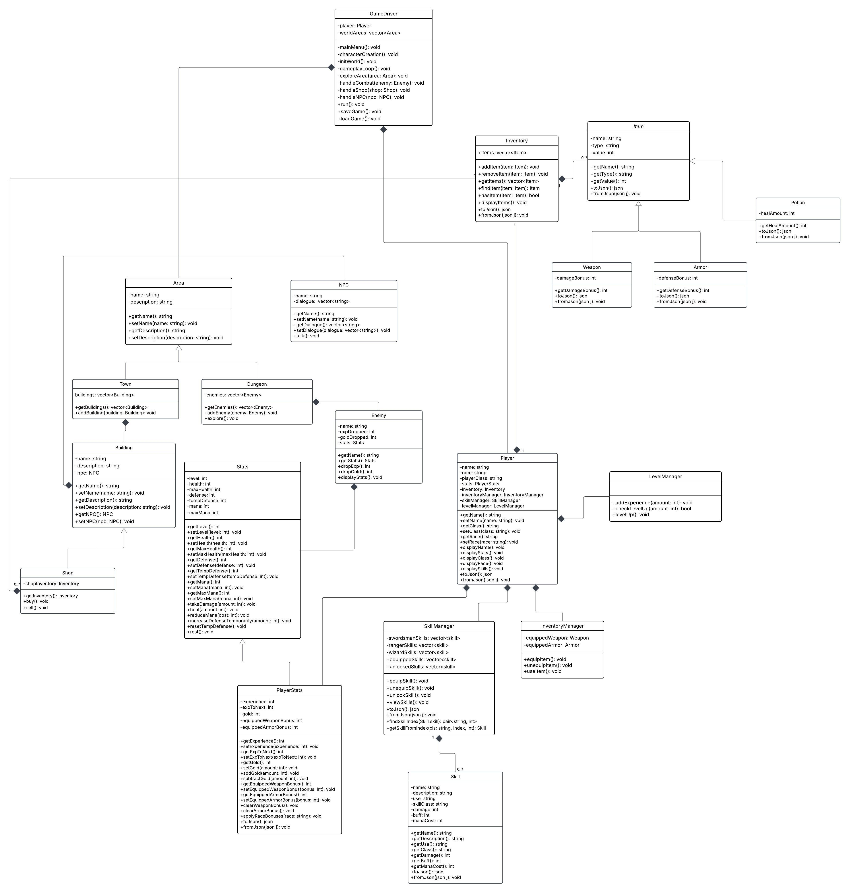
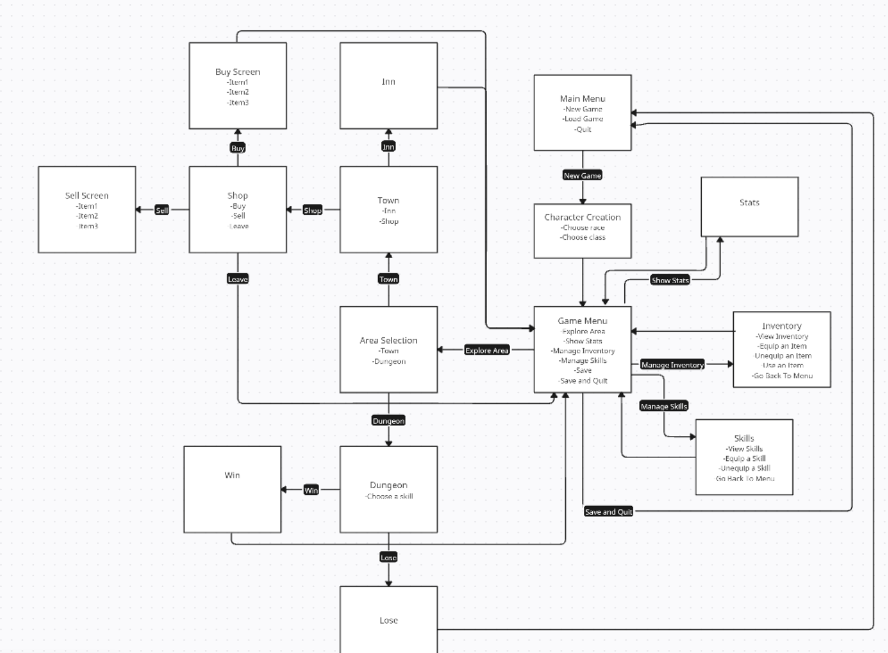

# Unearthing Dawnstar

## Overview
Unearthing Dawnstar is a text-based fantasy RPG written in C++ that emphasizes object-oriented design, modular architecture, and persistent state management. Players create a character, explore towns and dungeons, engage in turn-based combat, manage inventory and skills, and progress through a stat-driven system.

## Key Features
- Character creation with race and class bonuses
- Turn-based combat with skills, mana, buffs, and defense
- Inventory system with equip/unequip functionality
- Shop economy (buy/sell items, gold management)
- Persistent save/load using JSON
- Exploration across towns and dungeons

## Future Improvements
- Quest system with multi-stage objectives
- Difficulty scaling (Beginner / Intermediate / Advanced)
- Multiple save slots
- Expanded environmental interactions

## Technologies Used
- C++
- STL
- CMake / Make
- nlohmann/json (save/load system)
- Google Test
  
## Design Evolution
This project originally began with a monolithic Player class and was later
refactored to follow SOLID principles, splitting responsibilities across
PlayerStats, SkillManager, InventoryManager, and LevelManager.

## Architecture
The project uses a modular, object-oriented design:
- GameDriver: main gameplay loop and navigation
- Player + Managers: stats, inventory, skills, leveling
- Combat system: turn-based, skill-driven encounters
- Items: polymorphic hierarchy (Weapon, Armor, Potion)
- Persistence: JSON-based save/load system

### Class Diagram


### Navigation Diagram
High-level view of menu and game-state transitions.


## Installation/Usage
1. Make a folder in your desired location and navigate to it in terminal.
2. Run ```git clone -n https://github.com/cs100/final-project-csand118-conwu008-lmart338-ajose038.git```
3. Make sure you are in the original folder and run ```cmake .```
4. Run ```make```
5. Run ```./game```

## Demo Notes
This project is implemented as a playable demo to showcase core systems
such as leveling, skill unlocking, combat flow, and game-over handling.
Certain enemy parameters are intentionally exaggerated (e.g., accelerated
experience gain or lethal encounters) to demonstrate these mechanics without
requiring extended playtime.

## Notes
This project was developed as part of a university course and completed with a
small team. I was primarily responsible for the core architecture and gameplay
systems.

