[](https://classroom.github.com/a/EvxoT0RF)
[](https://classroom.github.com/open-in-codespaces?assignment_repo_id=21190723) 
# Unearthing Dawnstar
 
  Authors: [Chase Audrey Sanders (csand118)](https://github.com/PugsinCoding), [Alec Joseph (ajose038)](https://github.com/Emeyrald), [Lyova Martirosyan (lmart338)](https://github.com/lyova-martirosyan), [Chiagoziem Onwubuya
 (conwu008)](https://github.com/altairify)

## Project Description
### Why is it important or interesting to you?
  * Unearthing Dawnstar is a text-based fantasy RPG with magic set in a medieval time period. This project is a fun and involved way to get experience and to see what we can expect if we decided to enter this field in the future. It will also help keep us engaged by letting us be creative with the story and other game systems, instead of something like a task scheduler, which may be less interesting and engaging.
### What languages/tools/technologies do you plan to use?
  * We'll use C++, Github, VS Code, and Google Test in our project.
### What will be the input/output of your project? 
  * The input of our project will be user input through command line. The output of our project will be text based on what the user inputted.
### What are the features that the project provides?
  * At the start of the game, you can choose different races that each have a unique effect on gameplay (Ex: Bonus to certain stats)
  * Can choose between different classes that allow for unique gameplay i.e. archer vs swordsman vs magician
  * Spells and Skills
    * Player must level up to access new spells and skills
  * Saving and loading
  * Inventory system
    * Player can change equipped items (weapons and armor)
  * Attacking (Weapons/Magic)
  * Health and Mana
  * Level system
  * Player can enter combat with enemies
    * Loot dropped after combat
  * Shops buy and sell items
  * Player has gold
    * Player gets gold from defeating enemies
    * Player gets gold from selling items
  * Using healing items
  * Exploration
    * Player moves between different areas
  * Environmental interaction
    * Player can interact with different objects in the environment, like traps, doors, puzzles, etc.
  * Story
  * Difficulty setting that affects the health of enemies and the amount of damage they do

## Phase II
### Navigation Diagram
This diagram represents the different screens the player can go to, and how they can interact with the world.
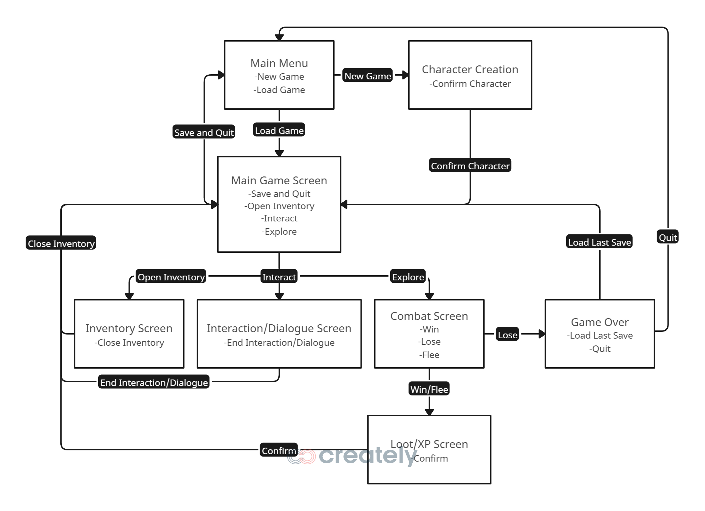

### Screen Layout
Every screen will use the same layout. There will be text for the output, text for the options you can take, and the input will be through the command line. An example would be:

You come to the forest and see a goblin.  
1. Fight
2. Flee  

$ Fight

### Class Diagram - Updated with feedback
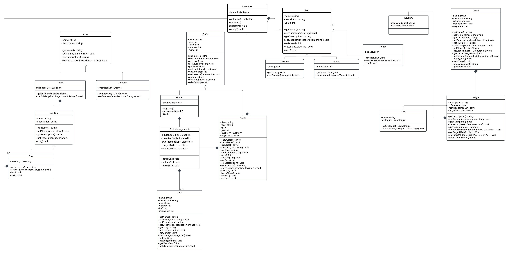

## Phase III
### Class Diagram - Updated with SOLID principles
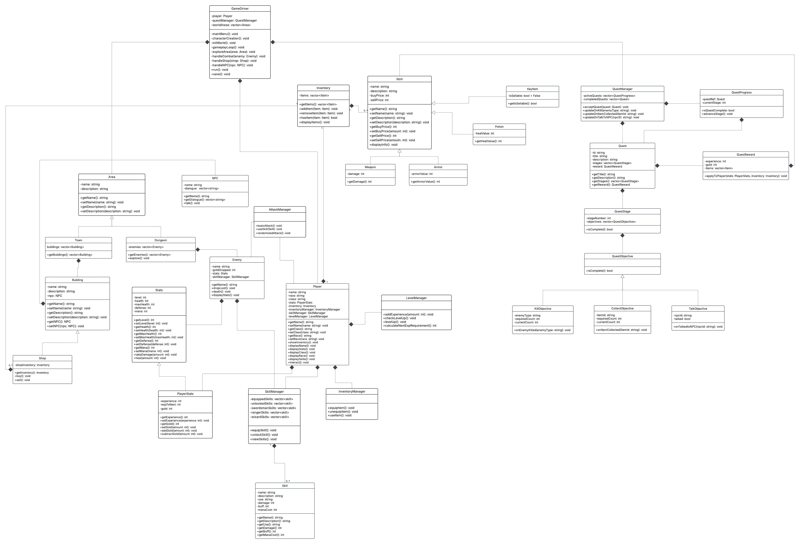
#### Description:
* The Player class holds the class, race, of the player and references to classes for the player's stats, inventory, skills, and level. This class holds simple methods that just display the data it contains.
* The LevelManager class updates the player's level.
* The InventoryManager class has methods that affect the player's inventory.
* The AttackManager class holds methods for an entity to attack another entity.
* The SkillManager class has vectors that hold the players' skills and methods to change them.
* The Skill class holds the attributes and methods relevant to each skill.
* The Stats Class holds the attributes and methods relevant to all stats
* The PlayerStats inherits from Stats and holds additional attributes, and the methods that affect them, which are needed for the player.
* The SkillManagment class holds all the skills 
* The PlayerStats class holds the player's stats and methods that change those stats.
* The GameDriver class holds the gameplay loop.
* The Inventory class holds a vector for items and methods to modify that vector as well as display them.
* The Item class holds the name, description, and price attributes and their respective getters and setters, as well as a display method.
* The Weapon class inherits from Item and has a damage attribute as well as its getter method.
* The Armor class inherits from Item and has an armorValue attribute as well as its getter method.
* The Potion class inherits from Item and has a healValue attribute and its getter method.
* The KeyItem class inherits from Item and ensures items are not sellable.
* The QuestManager class holds vectors for active and completed quests as well as methods to accept and update quests.
* The Quest class holds identifier, title, and description attributes and their respective getter methods. Quest references other classes for its stages and rewards attributes.
* The QuestProgress class is used to advance through the quest stages and mark the quest as complete.
* The QuestReward class holds the rewards for the quest and applies them to the player.
* The QuestStage class holds the stageNumber, objectives, and a method to update completion status
* The QuestObjective class has a method to update completion status for objectives
* The KillObjective, CollectObjective, and TalkObjective classes inherit from QuestObjective and handle their respective objective type.

#### Changes:
* We changed the Player class into the Player, PlayerStats, LevelManager, SkillManager, and Inventory Manager.
  * We applied the Single Responsibility Principle since before, the Player class had too many variables and methods, so we split it up into the 5 classes so that it was easier to manage and code.
  * We gave PlayerStats all the numerical variables and ways to change those variables, LevelManager has the methods for leveling up, SkillManager has vectors and methods for managing the skills, InventoryManager has methods to manage the inventory, and Player includes those 4 classes, and keeps the string variables, and has methods for displaying everything for the player.
* We changed Quest and QuestStage into QuestManager, QuestProgress, Quest, QuestReward, QuestStage, QuestObjective, KillObjective, CollectObjective, and TalkObjective.
  * We applied the Single Responsibility Principle since the original classes were a mess and needed to be split up to make it easier to manage and code.
  * It also wasn't organized well, and likely would not have worked.
* We added the GameDriver class, but only because it was needed, not for a SOLID principle. It managed the entire game and has the gameplay loop inside it.

## Phase IV
### Navigation Diagram

### Class Diagram

 
## Screenshots
Main Menu  
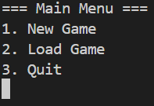  
Character Creation  
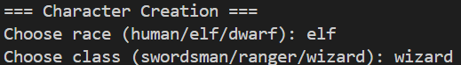  
Game Menu  
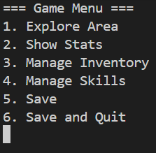  
Area Selection  
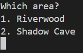  
Town  
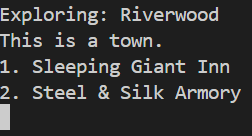  
Inn  
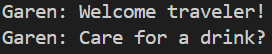  
Shop  
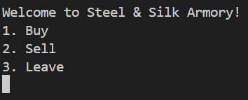  
Buy/Sell  
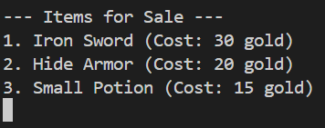  
Stats  
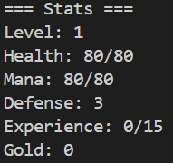  
Inventory  
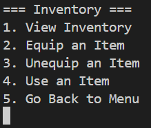  
Skills  
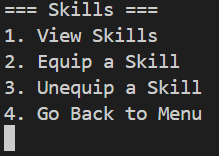  
Dungeon  
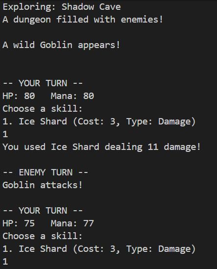  
Win  
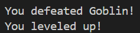  
Lose  
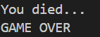  
## Installation/Usage
1. Make a folder in your desired location and navigate to it in terminal.
2. Run ```git clone -n https://github.com/cs100/final-project-csand118-conwu008-lmart338-ajose038.git```
3. Make sure you are in the original folder and run ```cmake .```
4. Run ```make```
5. Run ```./game```
## Testing
How was your project tested/validated?
* We tested our project using googletest and by running the program itself.  
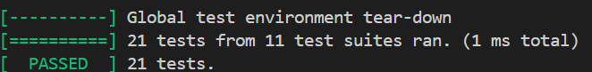
## Features
 * At the start of the game, you can choose different races that each have a unique effect on gameplay (Ex: Bonus to certain stats)
  * Can choose between different classes that allow for unique gameplay i.e. archer vs swordsman vs magician
  * Skills
    * Player must level up to access new skills
  * Saving and loading
  * Inventory system
    * Player can change equipped items (weapons and armor)
  * Attacking (Skills)
  * Health and Mana
  * Level system
  * Player can enter combat with enemies
    * Loot dropped after combat
  * Shops buy and sell items
  * Player has gold
    * Player gets gold from defeating enemies
    * Player gets gold from selling items
  * Using healing items
  * Exploration
    * Player moves between different areas
  ## Planned Features
  We were not able to finish or start these Planned Features
  * Story
  * Difficulty setting that affects the health of enemies and the amount of damage they do
    * Beginner
    * Intermediate
    * Advanced
  * Quest system
  * Multiple Save Files
  * Healing during battle
  * Environmental interaction
    * Player can interact with different objects in the environment, like traps, doors, puzzles, etc.
